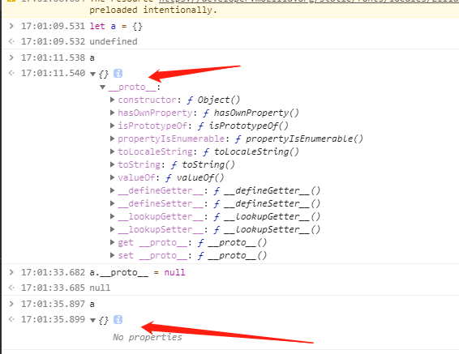
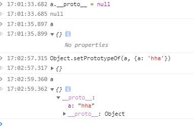

> `new运算符`是创建一个用户自定义的对象类型的实例 or 具备构造函数的内置对象的实例

像Date，Array。。。是js内置的一些Object对象，用户自己创建的构造函数，new 关键字进行的作用有以下操作：

- 创建一个空的对象， {}
- 链接刚才创建的对象（构建当前创建对象的构造函数）到另一个对象
- 将刚新创建的对象作为this的上下文
- 如果该函数没有返回对象，则返回this

```js
function People(name, age) {
  this.name = name
  this.age = age
}

const man = new People('Tom', 18)
```

> 实现如下 [具体请跳转YCK大佬的掘金](https://juejin.im/post/5c7b963ae51d453eb173896e)

```js
function createNew (func, ...args) {
  let obj = {}
  Object.setPrototypeOf(obj, func.prototype)
  let result = func.apply(obj, args)
  return result instanceof Object ? result : obj
}
```
`Object.setPrototypeOf()`设置一个指定的对象的原型到另一个对象。简单的可以理解为某个对象的`__proto__ `设置成另外一个对象




