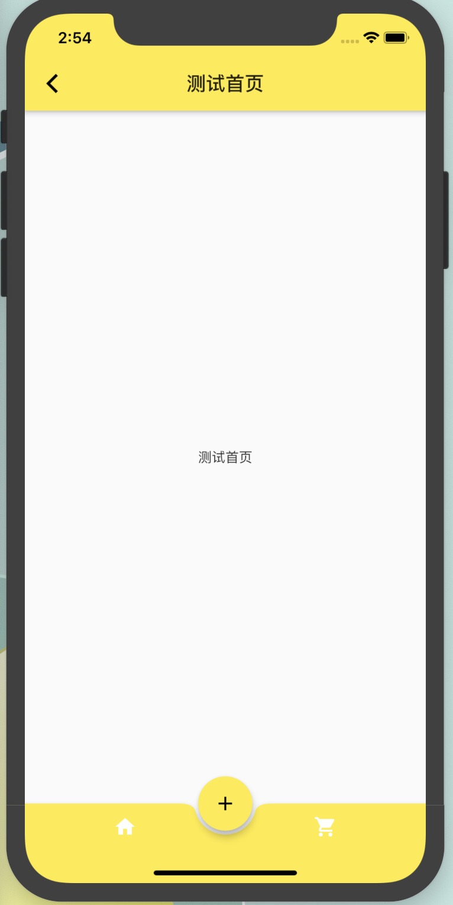

```dart

import 'package:flutter/material.dart';

/*
 * 不规则的bottomBar demo
 */
class IrregularityBottomNavBar extends StatefulWidget {
  IrregularityBottomNavBar({Key key}) : super(key: key);

  _IrregularityBottomNavBar createState() => _IrregularityBottomNavBar();
}

class _IrregularityBottomNavBar extends State<IrregularityBottomNavBar> {
  List<Widget> _testPage = [
    TestPage('测试首页'),
    TestPage('测试购物车')
  ];
  int _index = 0;

  @override
  Widget build(BuildContext context) {
    return Scaffold(
      // appBar: AppBar(
      //   title: Text('不规则的bottomBar'),
      // ),
      body: _testPage[_index],
      floatingActionButton: FloatingActionButton(
        onPressed: (){
          Navigator.of(context).push(MaterialPageRoute(
            builder: (BuildContext context) {
              return TestPage('FloatingActionButton 路由页面');
            }
          ));
        },
        child: Icon(Icons.add),
        tooltip: '按钮',
      ),
      floatingActionButtonLocation: FloatingActionButtonLocation.centerDocked,
      bottomNavigationBar: BottomAppBar(
        color: Colors.yellow,
        shape: CircularNotchedRectangle(), // 原形缺口
        child: Row(
          mainAxisSize: MainAxisSize.max,
          mainAxisAlignment: MainAxisAlignment.spaceAround,
          children: <Widget>[
            IconButton(
              icon: Icon(Icons.home),
              color: Colors.white,
              onPressed: () {
                setState(() {
                  _index = 0;
                });
              },
            ),
            IconButton(
              icon: Icon(Icons.shopping_cart),
              color: Colors.white,
              onPressed: () {
                setState(() {
                  _index = 1;
                });
              },
            )
          ],
        )
      ),
    );
  }
}

// 测试页面
class TestPage extends StatefulWidget {
  String _Title;
  TestPage(this._Title);

  _TestPageState createState() => _TestPageState();
}

class _TestPageState extends State<TestPage> {
  @override
  Widget build(BuildContext context) {
    return Scaffold(
      appBar: AppBar(
        title: Text(widget._Title),
      ),
      body: Center(
       child: Text(widget._Title),
      ),
    );
  }
}
```