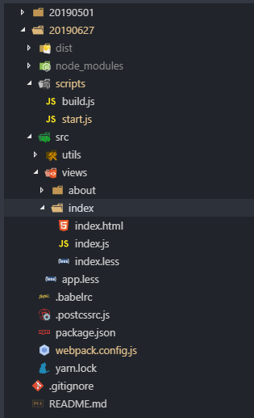

### 项目目录结构



### webpack 全部配置

```js

const fs = require('fs')
const path = require('path')
const htmlWebpackPlugin = require('html-webpack-plugin')
const TerserPlugin = require('terser-webpack-plugin')
const OptimizeCSSAssetsPlugin = require('optimize-css-assets-webpack-plugin')
const safePostCssParser = require('postcss-safe-parser')
const MiniCssExtractPlugin = require('mini-css-extract-plugin')
const webpack = require('webpack')

const viewsDir = path.resolve(__dirname, './src/views')
const isEnvProduction = process.env.NODE_ENV === 'production'

// 多入口配置
const entryJSAndHtml = () => {
  let entries = {}
  let htmlTemplate = {}

  try {
    const views = fs.readdirSync(viewsDir)
    views.forEach(fileName => {
      entries[fileName] = [
        path.join(__dirname, 'src/views', fileName, 'index.js')
      ]
      htmlTemplate[fileName] = path.join(__dirname, 'src/views', fileName, 'index.html')
    })

  } catch (err) {
    throw err
  }

  return {
    entries,
    htmlTemplate
  }
}

const JS_HTML_CONFIG = entryJSAndHtml()

// htmlWebpackPlugin
const htmlWebpackPluginConfig = () => {
  let htmlPlugins = []

  for (let key in JS_HTML_CONFIG.htmlTemplate) {
    htmlPlugins.push(
      new htmlWebpackPlugin({
        template: JS_HTML_CONFIG.htmlTemplate[key],
        filename: `${key}.html`,
        inject: true,
        hash: true,
        chunks: ['vendor', 'common', key],
        minify: isEnvProduction ? {
          removeComments: true,
          collapseWhitespace: true,
          removeAttributeQuotes: true
        } : false
      })
    )
  }

  return htmlPlugins
}

module.exports = {
  mode: isEnvProduction ? 'production' : 'development',
  entry: JS_HTML_CONFIG.entries,
  output: {
    path: isEnvProduction ? path.resolve(__dirname, './dist') : undefined,
    pathinfo: !isEnvProduction,
    filename: 'static/js/[name].[hash:8].js',
    futureEmitAssets: true,
    publicPath: './',
  },
  devtool: isEnvProduction ? 'source-map' : 'cheap-module-source-map',
  module: {
    rules: [
      {
        test: /\.(css|less)$/,
        use: !isEnvProduction ? ["style-loader", "css-loader", "postcss-loader", "less-loader"] : [
          MiniCssExtractPlugin.loader,
          'css-loader',
          'postcss-loader',
          'less-loader'
        ]
      },
      {
        test: /\.html$/,
        use: [
          'html-loader'
        ]
      },
      {
        test: /\.js$/,
        use: [
          {
            loader: 'babel-loader',
            options: {
              exclude: /node_modules/,
              include: path.resolve(__dirname, './src')
            }
          }
        ]
      },
      {
        test: /\.(png|jpg|gif)$/,
        use: [{
          loader: 'url-loader',
          options: {
            limit: 2 * 1024,
            outputPath: 'images'
          }
        }]
      },
      {
        test: /\.(woff2?|eot|ttf|otf)(\?.*)?$/,
        loader: 'url-loader',
        options: {
          limit: 10000,
          outputPath: 'fonts'
        }
      }
    ]
  },
  optimization: {
    // 是否开启压缩
    minimize: isEnvProduction,
    // production mode 才会使用
    minimizer: [
      new TerserPlugin({
        terserOptions: { // Terser minify options.
          parse: {
            ecma: 8,
          },
          compress: {
            ecma: 5,
            warnings: false,
            comparisons: false,
            inline: 2,
          },
          mangle: {
            safari10: true,
          },
          output: {
            ecma: 5,
            comments: false, // 是否保留注释
            ascii_only: true,
          },
        },
        parallel: true, // 使用多进程并行运行来提高构建速度
        cache: true, // 启动文件缓存
        sourceMap: !isEnvProduction
      }),
      // 用于优化或者压缩CSS资源
      new OptimizeCSSAssetsPlugin({
        cssProcessorOptions: {
          parser: safePostCssParser,
          map: !isEnvProduction
            ? {
              inline: false,
              annotation: true,
            }
            : false,
        },
      })
    ],
    splitChunks: {
      chunks: 'all',
      name: false,
      cacheGroups: { // 缓存组
        vendor: {
          name: 'vendor',
          test: /node_modules/,
          chunks: 'initial',
          priority: 10
        },
        common: {
          name: 'common',
          chunks: 'initial',
          minChunks: 2,
          minSize: 0
        }
      }
    },
  },
  resolve: {
    alias: {
      '@': path.resolve(__dirname, './src')
    }
  },
  plugins: [
    new webpack.DefinePlugin({
      'process.env': process.env.NODE_ENV
    }),
    isEnvProduction && new MiniCssExtractPlugin({
      filename: "static/css/[name].[hash:8].css",
      chunkFilename: 'static/css/[name].[hash:8].css'
		}),
    ...htmlWebpackPluginConfig()
  ].filter(Boolean)
}

```

### 生产环境入口

```js
const ora = require('ora')
const rm = require('rimraf')
const path = require('path')
const chalk = require('chalk')
const Webpack = require('webpack')
const webpackConfig = require('../webpack.config.js')

const spinner = ora('正在构建生产环境代码...').start()
rm(path.join(__dirname, '../dist'), err => {
  if (err) throw err
  Webpack(webpackConfig, (err, stats) => {
    spinner.stop()
    if (err) throw err
    process.stdout.write(stats.toString({
      colors: true,
      modules: false,
      children: false,
      chunks: false,
      chunkModules: false
    }) + '\n\n')

    if (stats.hasErrors()) {
      console.log(chalk.red('  Build failed with errors.\n'))
      process.exit(1)
    }

    console.log(chalk.cyan('  Build complete.\n'))
  })
})

```

### 开发环境入口

```js

const path = require('path')
const WebpackDevServer = require('webpack-dev-server')
const Webpack = require('webpack')
const chalk = require('chalk')

const webpackConfig = require('../webpack.config')

const PORT = process.env.HOST_PORT || 8080

const addEntryHotPath = () => {
  for (let key in webpackConfig.entry) {
    webpackConfig.entry[key].unshift(`webpack-dev-server/client?http://localhost:${PORT}/`, 'webpack/hot/dev-server')
  }
}

addEntryHotPath()

const compiler = Webpack(webpackConfig)
const server = new WebpackDevServer(compiler, {
  contentBase: path.resolve(__dirname, '../dist'),
  clientLogLevel: 'warning',
  historyApiFallback: true,
  compress: true, // 打包进度
  hot: true, // 热加载
  inline: true,
  progress: true,
  open: true, //自动打开浏览器
  overlay: { // 报错信息
    warnings: true,
    errors: false
  },
  noInfo: false,
  proxy: {}, // 代理接口转发
  quiet: true, // 日志信息
  watchOptions: {
    aggregateTimeout: 300,
    poll: 1000
  },
  // before (app, server) {

  // },
  // setup: function(app) {
  //webpack-dev-server 本身是 Express 服务器可以添加自己的路由
  // app.get('/some/path', function(req, res) {
  //   res.json({ custom: 'response' })
  // })
  // },
  //配置 https 需要的证书等
  // https: {
  //   cert: fs.readFileSync("path-to-cert-file.pem"),
  //   key: fs.readFileSync("path-to-key-file.pem"),
  //   cacert: fs.readFileSync("path-to-cacert-file.pem")
  // }
})

server.listen(PORT, '0.0.0.0', function () {
  console.log()
  console.log('🔥  server is running at:', chalk.cyan(`http://localhost:${PORT}/\n`))
})

```